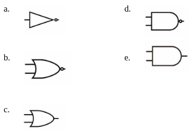

# Soal pilihan ganda (pilih: a,b,c,d,e)
## 1.
- jika semua variabel input berlogika "1" maka variabel output akan berlogika "1". Pernyataan tersebut merupakan prinsip dari....
```
a. Gerbang AND
b. Gerbang OR
c. Gerbang NOT
d. Gerbang NAND
e. Gerbang NOR
```
- jawaban: `a`

## 2. Perhatikan Gambar berikut!

- Logika masukan dan keluaran yang sesuai dengan gerbang logika adalah....
```
a. A = 0 ; B = 0 ; Q = 1
b. A = 0 ; B = 1 ; Q = 1
c. A = 1 ; B = 0 ; Q = 1
d. A = 1 ; B = 1 ; Q = 1
e. A = 1 ; B = 1 ; Q = 0
```
- jawaban `d`

## 3.
- Sebuah gerbang logika memiliki 4 buah input yaitu input A,B,C,D dan satu output. Ketika semua input diberi logika “1”, output juga akan “1”. Namun ketika ada salah satu input yang berlogika “0”, output akan langsung “0”. Jika A dan C berlogika “1”
sedangkan B dan D berlogika “0”, maka apa yang harus ditambahkan saat kita menginginkan output berlogika “1”?
- jawaban `c`
```
a. NOT di Kaki A dan B
b. NOT di kaki B dan C
c. NOT di kaki B dan D
d. NOT di kaki B dan D
e. NOT di semua kaki
```

## 4
- Gambar rangkaian yang sesuai dengan prinsip gerbang logika NOT yaitu:

- jawaban: `e`

## 5 Perhatikan gambar berikut!

- Logika masukan dan keluaran yang sesuai dengan gerbang logika diatas adalah...
```
a. A = 1 ; B = 1 ; Q = 1	
b. A = 0 ; B = 1 ; Q = 0	
c. A = 1 ; B = 0 ; Q = 0
d. A = 0 ; B = 0 ; Q = 1
e. A = 1 ; B = 1 ; Q = 0
```
- jawaban: `a`

## 6 Perhatikan gambar berikut!

- Rangkaian diatas sesuai dengan prinsip gerbang logika dengan simbol...

- jawaban: `d`

## 7
- Gerbang logika yang hanya dapat memiliki variabel output berlogika "0" jika semua variabel input berlogika"0" maka pernyataan tersebut merupakan prinsip dari....
```
a. Gerbang AND	
b. Gerbang OR
c. Gerbang NOT
d. Gerbang NAND
e. Gerbang NOR
```
- jawaban `b`

## 8
- Gerbang logika yang memiliki fungsi inverter. Pernyataan tersebut merupakan prinsip dari....
```
a. Gerbang AND	
b. Gerbang OR	
c. Gerbang NOT
d. Gerbang NAND
e. Gerbang NOR
```
- jawaban `c`

## 9
- Gambar rangkaian gerbang logika dengan persamaan fungsi **Q = A + B + C** adalah....

- jawaban `e`

## 10 Perhatikan Gambar berikut!

- Fungsi keluaran dari gambar rangkaian di atas adalah F = ....
```
a. (A+C).(B+C)
b. (A+B).(B+C)
c. AB+AC
d. AB+BC
e. AC+BC
```
- jawaban `e`

## 11 Perhatikan gambar berikut!

- Fungsi keluaran dari gambar rangkaian diatas adalah Q =....
```
a. (A · B) + C
b. (A · B) + C̅
c. (A + B) · C
d. (A + B) · C̅
e. (A · B · C̅)
```
- jawaban `d`

## 12 Perhatikan gambar berikut!

- Rangkaian gerbang logika yang setara dengan gambar diatas yaitu....

- jawaban `e`

## 13
- Variabel keluaran akan berlogika 0 hanya jika semua masukan dalam keadaan 1. Pernyataan tersebut merupakan prinsip dari....
```
a. Gerbang NOR
b. Gerbang NAND
c. Gerbang X-NOT
d. Gerbang X-NOR
e. Gerbang X-OR
```
- jawaban `b`

## 14
Persamaan fungsi **Q = A · B merupakan persamaan fungsi untuk....
```
a. Gerbang NAND
b. Gerbang NOR
c. Gerbang NOT
d. Gerbang X-OR
e. Gerbang X-NOR
```
- jawaban `a`

## 15
- Persamaan fungsi **Q = A + B** merupakan persamaan fungsi untuk....
```
a. Gerbang AND
b. Gerbang OR
c. Gerbang NOT
d. Gerbang NAND
e. Gerbang NOR
```
- jawaban `b`

## 16
- Simbol gerbang logika NOR di bawah ini yaitu...

- jawaban `d`

## 17 Perhatikan Tabel berikut

- Persamaan fungsi yang sesuai dengan tabel diatas yakni....

- jawaban `b`

## 18
- Fungsi NOR yang tepat adalah...
```
a. Penjumlahan
b. Perkalian
c. Inversi penjumlahan
d. Inversi perkalian
e. Penjumlahan khusus
```
- jawaban `c`

## 19
- Simbol dari gerbang logika kombinasi yang benar, yaitu....

- jawaban `e`

## 20

- Persamaan fungsi yang sesuai dengan tabel diatas yakni....

- jawaban `e`

## 21
- Simbol dari gerbang logika eksklusif yang benar, yaitu....

- jawaban `a`

## 22
- Ciri-ciri gerbagn X-OR yang benar yaitu....
a. Variabel keluaran akan berlogika ‘”1” hanya jika semua masukan dalam keadaan “0”
b. Variabel keluaran akan berlogika ‘”0” hanya jika semua masukan dalam keadaan “1”
c. Variabel keluaran akan berlogika ‘”0” hanya jika semua masukan dalam keadaan “0”
d. Variabel keluaran akan berlogika ‘”1” apabila kedua masukan berbeda logika.
e. Variabel keluaran akan berlogika ‘”0” apabila kedua masukan berbeda logika.
- jawaban `d`

## 23
- Persamaan fungsi X-NOR yang benar yaitu....

- jawaban `d`

## 24 Perhatikan gambar berikut!

- Rangkaian gerbang logika yang seteara dengan gambar diatas yaitu....

- jawaban `e`

## 25
- Gambar rangkaian logika dengan persamaan fungsi **Q = A.(B.C)** adalah....

- jawaban `b`
